# AI Subtopic Diagram Companion

Source rule: this companion uses only the concepts already present in the supplied PDFs and the notes created from them. The diagrams are simplified visual versions of those source concepts.

How to use this file: study the short analysis first, then use the diagram to remember the flow, relationship, or structure.

---

## 01 Introduction-rrm2024.pdf

### What is Artificial Intelligence?

**Diagram needed:** Yes. AI is introduced as a broad field with many human-like tasks, so a concept map helps connect the definition to examples.

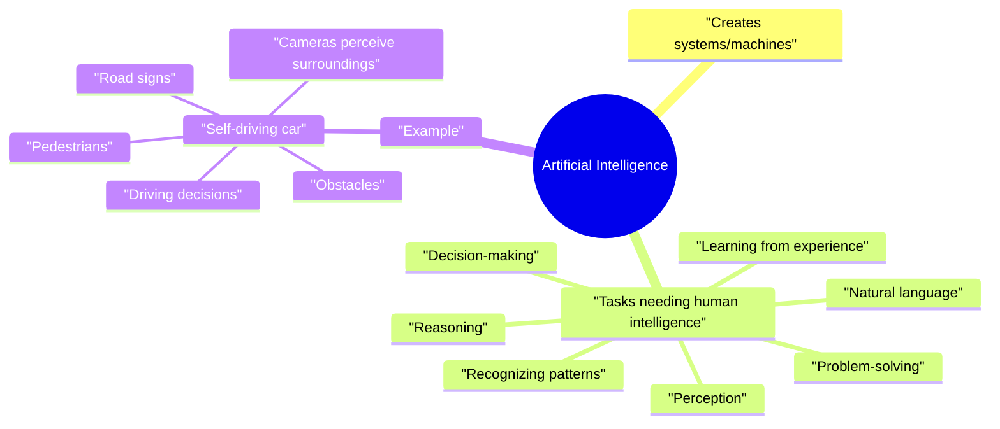

### Intelligence

**Diagram needed:** Yes. The four levels are easier to remember as a ladder.

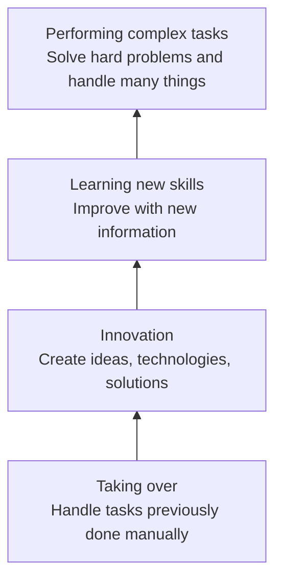

### Historical Context

**Diagram needed:** Yes. AI history is chronological, so a timeline is useful.

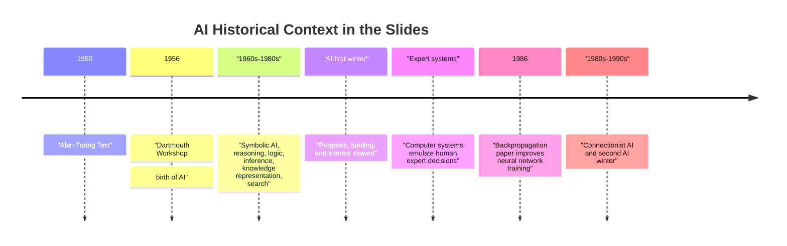

### Turing Test

**Diagram needed:** Yes. The test is a communication setup.

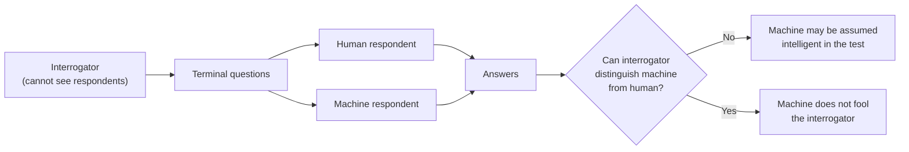

### Machine Learning

**Diagram needed:** Yes. The difference between traditional programming and ML is a core comparison.

| Traditional programming | Machine learning |
|---|---|
| Human gives data and rules. | Human gives data and results. |
| Computer produces results. | Computer learns rules. |

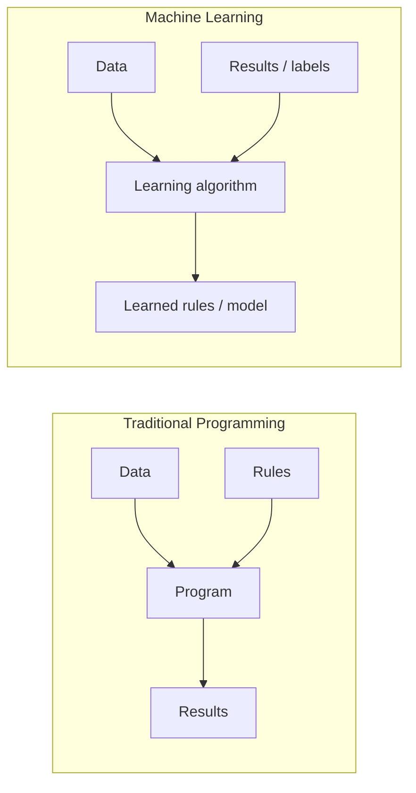

### Types of AI, Machine Learning, and Deep Learning

**Diagram needed:** Yes. The slides show AI, ML, and deep learning as nested ideas.

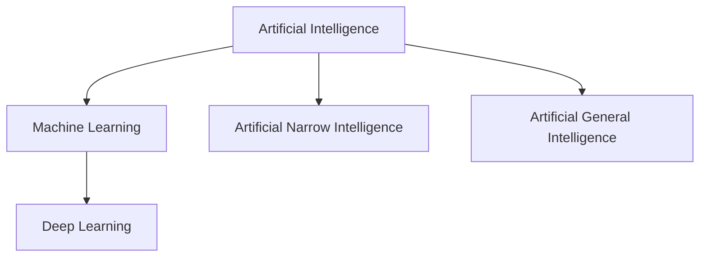

### Deep Learning

**Diagram needed:** Yes. Multiple hidden layers are the main idea.

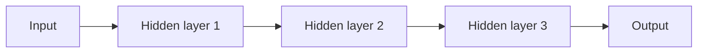

### Discriminative versus Generative

**Diagram needed:** Yes. The contrast is exam-friendly as a side-by-side flow.

| Discriminative | Generative |
|---|---|
| Recognizes or classifies. | Creates new content. |
| Example: given a picture, tell who it is. | Example: create a non-existing person's face. |

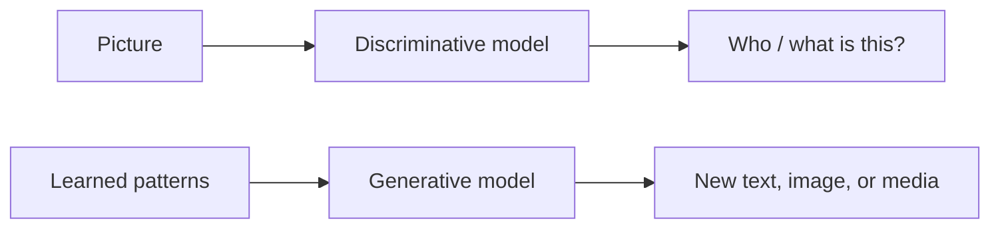

### Risks of AI

**Diagram needed:** Yes. Risks are many, so grouping helps revision.

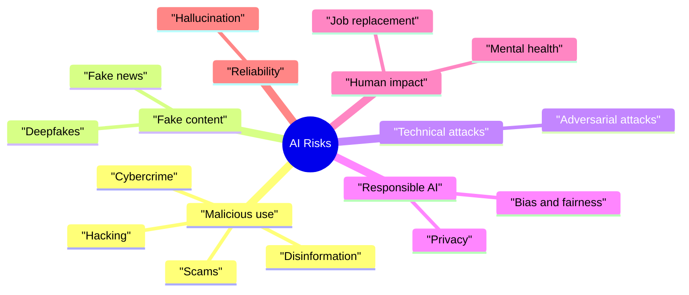

---

## 02 Logic and inference- sem 2 202526 (2).pdf

### Knowledge Representation

**Diagram needed:** Yes. The chapter compares logic, semantic networks, and production rules.

| Method | Best visual memory |
|---|---|
| Logic | Formal symbols and truth. |
| Semantic networks | Nodes and links. |
| Production rules | IF condition THEN action. |

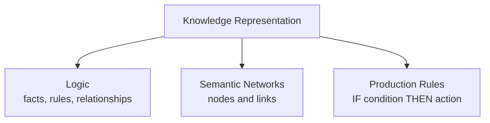

### Syntax and Semantics

**Diagram needed:** Yes. Students often confuse the two.

| Syntax | Semantics |
|---|---|
| How symbols are legally arranged. | What the symbols mean. |

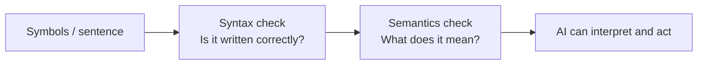

### 🚨 EXAM TOPIC: Predicate and Propositional Logic 🚨

**Diagram needed:** Yes. This is a critical exam comparison.

| Propositional logic | Predicate logic / FOL |
|---|---|
| Whole statements are true or false. | Talks about objects, properties, relationships, and quantities. |
| Uses P, Q, R as statements. | Uses predicates such as Brothers(Ravi, Ajay). |

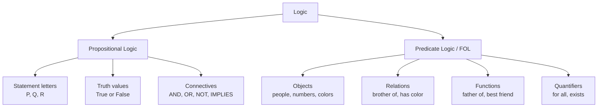

### Logical Connectives and Truth Values

**Diagram needed:** Yes. Connectives are easier with a compact truth table.

| P | Q | P AND Q | P OR Q | P -> Q |
|---|---|---|---|---|
| True | True | True | True | True |
| True | False | False | True | False |
| False | True | False | True | True |
| False | False | False | False | True |

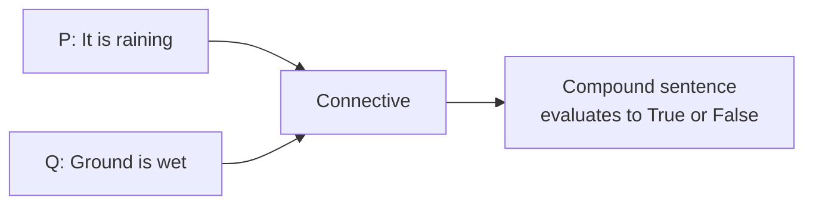

### Modus Ponens

**Diagram needed:** Yes. It is a rule with two premises and one conclusion.

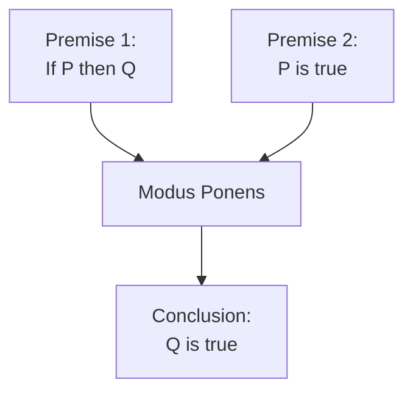

### Arguments, Premises, and Conclusions

**Diagram needed:** Yes. The logic flow is simple but important.

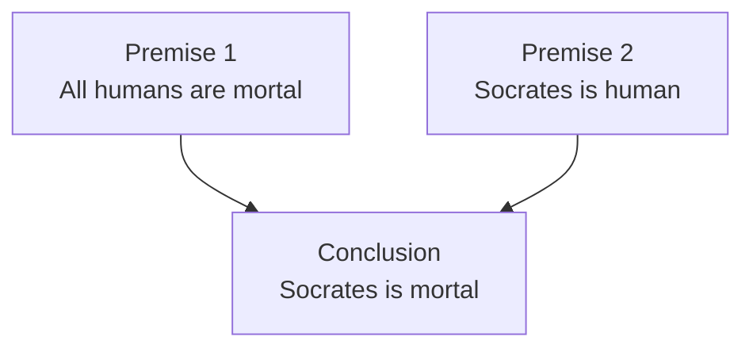

### Syllogism and Deductive Reasoning

**Diagram needed:** Yes. Valid and invalid syllogisms are a comparison.

| Valid syllogism | Invalid syllogism |
|---|---|
| Conclusion follows from the premises. | Conclusion does not follow from the premises. |

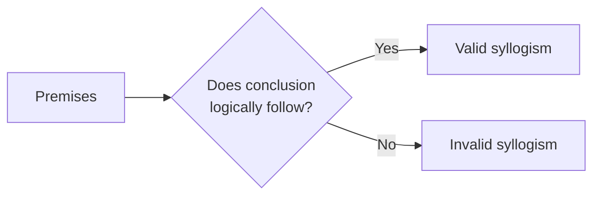

### Quantifiers in First-Order Logic

**Diagram needed:** Yes. The difference between "all" and "some" is central.

| Quantifier | Symbol | Main connective from slides |
|---|---|---|
| Universal | ∀ | Implication -> |
| Existential | ∃ | AND ∧ |

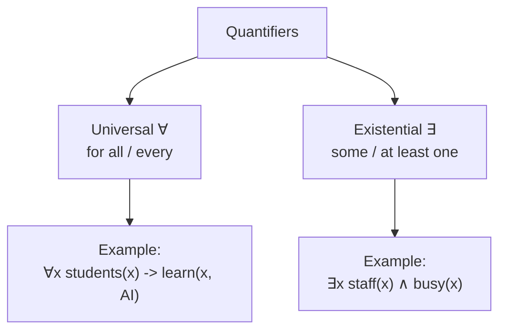

---

## 03 CSNB4133_Chap3- sem 1 2024 2025.pdf

### State Search Representation

**Diagram needed:** Yes. A state space is naturally a graph/tree.

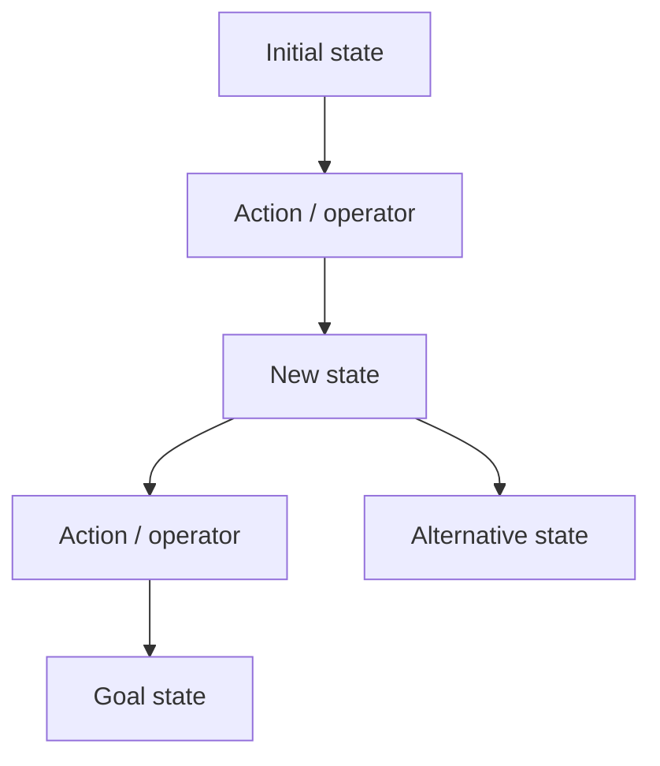

### Path, Path Cost, and Goal Test

**Diagram needed:** Yes. These three terms work together in search.

| Term | Visual role |
|---|---|
| Path | Route through states. |
| Path cost | Number/cost attached to a route. |
| Goal test | Check whether a state is the goal. |

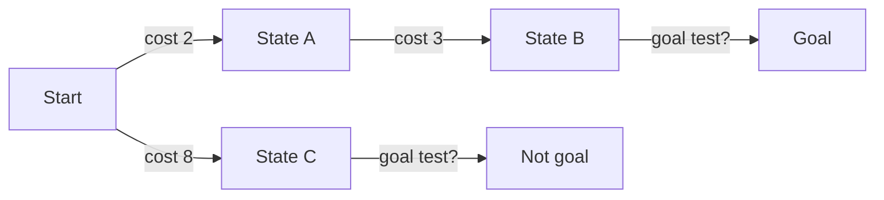

### 🚨 EXAM TOPIC: Search Trees 🚨

**Diagram needed:** Yes. This is a main exam area.

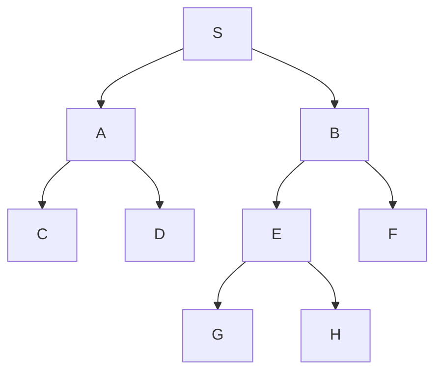

### Evaluating a Search

**Diagram needed:** Yes. The four criteria are a checklist.

```mermaid
flowchart TD
  SEARCH["Search method"] --> C["Completeness<br/>Will it find a solution?"]
  SEARCH --> T["Time complexity<br/>How long?"]
  SEARCH --> S["Space complexity<br/>How much memory?"]
  SEARCH --> O["Optimality<br/>Best solution?"]
```

### Search Methods

**Diagram needed:** Yes. The categories prevent confusion.

```mermaid
flowchart TD
  SM["Search Methods"] --> BS["Blind / Uninformed"]
  BS --> DFS["Depth-first"]
  BS --> BFS["Breadth-first"]
  BS --> BI["Bi-directional"]
  BS --> ID["Iterative deepening"]
  BS --> DL["Depth-limited"]
  BS --> UC["Uniform cost"]

  SM --> HS["Heuristic / Informed"]
  HS --> HC["Hill-climbing"]
  HS --> BF["Best-first"]
  HS --> GT["Generate and test"]
  HS --> IN["Induction"]
  HS --> GR["Greedy search"]

  SM --> OS["Optimal"]
  OS --> AS["A* search"]
```

### Depth-First Search (DFS)

**Diagram needed:** Yes. DFS is a traversal pattern.

| Source DFS order | S, A, C, D, B, E, G, H, F |
|---|---|

```mermaid
flowchart TD
  S["1 S"] --> A["2 A"]
  S --> B["5 B"]
  A --> C["3 C"]
  A --> D["4 D"]
  B --> E["6 E"]
  B --> F["9 F"]
  E --> G["7 G"]
  E --> H["8 H"]
```

### 🚨 EXAM TOPIC: Breadth-First Search (BFS) 🚨

**Diagram needed:** Yes. BFS is level-by-level.

| Source BFS order | S, A, B, C, D, E, F, G, H |
|---|---|

```mermaid
flowchart TD
  S["Level 0: S"] --> A["Level 1: A"]
  S --> B["Level 1: B"]
  A --> C["Level 2: C"]
  A --> D["Level 2: D"]
  B --> E["Level 2: E"]
  B --> F["Level 2: F"]
  E --> G["Level 3: G"]
  E --> H["Level 3: H"]
```

### DFS vs BFS

**Diagram needed:** Yes. This is one of the easiest exam comparisons.

| Feature | DFS | BFS |
|---|---|---|
| Movement | Branch by branch. | Row by row. |
| Data behavior in slides | Children added to front of queue. | Children appended to end of queue. |
| Source order | S A C D B E G H F | S A B C D E F G H |

```mermaid
flowchart LR
  T["Same search tree"] --> DFS["DFS<br/>go deep first"]
  T --> BFS["BFS<br/>finish level first"]
```

### Heuristic Search

**Diagram needed:** Yes. Heuristic search prunes weak choices.

```mermaid
flowchart TD
  P["Problem / goal state"] --> E["Evaluate possible nodes"]
  E --> K["Keep promising nodes"]
  E --> X["Prune non-promising nodes"]
  K --> G["Good enough solution faster"]
```

### 🚨 EXAM TOPIC: Hill-Climbing Search 🚨

**Diagram needed:** Yes. Hill-climbing depends on choosing the most promising next node.

```mermaid
flowchart TD
  A["Current node"] --> B["Generate children"]
  B --> C["Measure promise / closeness to goal"]
  C --> D["Choose best-looking child first"]
  D --> E{"Goal found?"}
  E -->|Yes| G["Stop"]
  E -->|No| F["Continue / backtrack if needed"]
  F --> B
```

### Problems with Hill-Climbing

**Diagram needed:** Yes. The three problems are shape-based.

| Problem | Memory image |
|---|---|
| Foothill | A smaller peak looks best nearby, but a higher peak exists elsewhere. |
| Plateau | Flat area; no clear best direction. |
| Ridge | High sloped area not reachable in one move. |

```mermaid
flowchart TD
  HC["Hill-climbing problem"] --> F["Foothill<br/>local peak"]
  HC --> P["Plateau<br/>flat values"]
  HC --> R["Ridge<br/>cannot reach in one move"]
```

### Best-First Search

**Diagram needed:** Yes. The open/closed list example in the slide is process-based.

```mermaid
flowchart TD
  A["Start with OPEN = [A]<br/>CLOSE = []"] --> B["Choose most promising node"]
  B --> C["Move chosen node to CLOSE"]
  C --> D["Add children to OPEN"]
  D --> E["Order OPEN by most promising first"]
  E --> F{"Target found?"}
  F -->|No| B
  F -->|Yes| G["Return search path"]
```

---

## 05_CSNB234_Chap5_Notes_Knowledge_representation_sem_1_2024_2025.pdf

### Types of Knowledge

**Diagram needed:** Yes. The types are easier as a knowledge map.

```mermaid
mindmap
  root((Knowledge in AI))
    "Object"
      "Facts about objects"
    "Events"
      "Actions that occur"
    "Performance"
      "How to do things"
    "Meta-knowledge"
      "Knowledge about what we know"
    "Facts"
      "Truths about the real world"
    "Knowledge-base"
      "Group of sentences"
```

### 🚨 EXAM TOPIC: Semantics / Semantic Networks 🚨

**Diagram needed:** Yes. Semantic networks are diagrams by nature.

```mermaid
flowchart LR
  Jerry["Jerry"] -->|is_a| Cat["cat"]
  Jerry -->|is_a| Mammal["mammal"]
  Jerry -->|owned_by| Priya["Priya"]
  Jerry -->|color| Brown["brown"]
  Mammal -->|is_a| Animal["animal"]
```

### Semantic Network: Lab Example

**Diagram needed:** Yes. It maps source statements into relationships.

```mermaid
flowchart LR
  Lab["LAB"] -->|is_a| Room["ROOM"]
  Lab -->|has_a| Door["DOOR"]
  Lab -->|has| Computers["COMPUTERS"]
  Printers["PRINTERS"] -->|in| Lab
  Laser["LASER_PRINTER"] -->|is_a| Printers
```

### Frames

**Diagram needed:** Yes. Frames are slot-value structures.

```mermaid
flowchart TD
  Book["BOOK frame"] --> T["Title: Qualitative Reasoning"]
  Book --> A["Author: Ken D. Forbus"]
  Book --> P["Publisher: Prentice-Hall"]
  Book --> Y["Year: 2000"]
```

### Production Rules

**Diagram needed:** Yes. The IF-THEN shape is essential.

```mermaid
flowchart LR
  IF["IF condition<br/>traffic-light is green"] --> THEN["THEN action<br/>go"]
  IF2["IF condition<br/>traffic-light is red"] --> THEN2["THEN action<br/>stop"]
```

### Firing of Rules

**Diagram needed:** Yes. It shows how facts and rules interact.

```mermaid
flowchart TD
  DB["Database facts"] --> MATCH["Condition matches?"]
  KB["Knowledge base rules"] --> MATCH
  MATCH -->|Yes| FIRE["Rule fires"]
  FIRE --> ACTION["Action executed"]
  ACTION --> NEW["New fact added to DB"]
  MATCH -->|No| STOP["Rule does not fire"]
```

### 🚨 EXAM TOPIC: Forward Chaining 🚨

**Diagram needed:** Yes. Forward chaining is a step-by-step flow.

```mermaid
flowchart LR
  F["Known facts / data"] --> R["Match rule condition"]
  R --> FIRE["Fire rule"]
  FIRE --> NF["Add new fact"]
  NF --> R
  R -->|No more matches| END["Stop"]
```

### Forward Chaining Example: A and B prove D

**Diagram needed:** Yes. The proof chain is linear.

```mermaid
flowchart LR
  AB["Known facts:<br/>A and B"] --> R3["R3:<br/>If B then E"]
  R3 --> E["New fact: E"]
  E --> R2["R2:<br/>If A and E then G"]
  R2 --> G["New fact: G"]
  G --> R4["R4:<br/>If G then D"]
  R4 --> D["Goal fact: D"]
```

### Forward Chaining Health Exercise

**Diagram needed:** Yes. It makes rule firing order clear.

```mermaid
flowchart LR
  START["Catholic<br/>eats poultry<br/>works 4 hours"] --> R9["R9:<br/>work 6 hours or less -> Friday"]
  R9 --> FRI["Friday"]
  FRI --> R4["R4:<br/>Catholic and Friday -> no fish and no beef"]
  R4 --> NOBEEF["No beef"]
  NOBEEF --> R2["R2:<br/>fish or poultry and no beef -> low cholesterol"]
  R2 --> LOW["Low cholesterol"]
  LOW --> R6["R6:<br/>low cholesterol -> healthy"]
  R6 --> H["Healthy"]
```

### Backward Chaining

**Diagram needed:** Yes. It is the reverse of forward chaining.

```mermaid
flowchart RL
  G["Goal"] --> R["Find rule that concludes goal"]
  R --> S["Make IF condition a subgoal"]
  S --> F["Check if subgoal is fact"]
  F -->|Yes| PROVE["Prove goal"]
  F -->|No| B["Backtrack / find supporting rule"]
```

### Backward Chaining Flight Example

**Diagram needed:** Yes. The goal is proved by tracing backward.

```mermaid
flowchart RL
  F6["Catch 6:00 flight"] --> C530["Check in by 5:30"]
  C530 --> P515["Park car by 5:15"]
  P515 --> L500["Leave home by 5:00"]
  L500 --> P430["Pack at 4:30"]
  P430 --> W400["Wake up at 4:00"]
```

### Forward Chaining vs Backward Chaining

**Diagram needed:** Yes. The direction is the whole difference.

| Forward chaining | Backward chaining |
|---|---|
| Data-driven. | Goal-driven. |
| Starts from known facts. | Starts from a goal. |
| Moves toward conclusions. | Searches backward for evidence. |

```mermaid
flowchart LR
  F1["Facts"] --> F2["Rules"] --> F3["Conclusion"]
  B1["Goal"] --> B2["Needed rule"] --> B3["Supporting facts"]
```

---

## 06 ML - First Iteration sem 1 2024 2025 (1).pdf

### Core Concepts of Machine Learning

**Diagram needed:** Yes. The process is a pipeline.

```mermaid
flowchart LR
  D["Data"] --> A["Algorithm"]
  A --> M["Model"]
  M --> TR["Training"]
  TR --> TE["Testing"]
```

### Types of Machine Learning

**Diagram needed:** Yes. The three types are a classification tree.

| Type | Key phrase |
|---|---|
| Supervised | Labeled data. |
| Unsupervised | No labels; find patterns. |
| Reinforcement | Trial, error, rewards, penalties. |

```mermaid
flowchart TD
  ML["Machine Learning"] --> SL["Supervised<br/>labeled data"]
  ML --> UL["Unsupervised<br/>hidden patterns"]
  ML --> RL["Reinforcement<br/>trial and error"]
```

### Machine Learning Tasks

**Diagram needed:** Yes. It shows which tasks belong to which learning type.

```mermaid
flowchart TD
  TASK["Machine Learning Tasks"] --> C["Classification<br/>predefined classes<br/>supervised"]
  TASK --> R["Regression<br/>continuous values<br/>supervised"]
  TASK --> CL["Clustering<br/>similar groups<br/>unsupervised"]
  TASK --> AS["Association<br/>rules in large data<br/>unsupervised"]
```

### Challenges in Machine Learning

**Diagram needed:** Yes. Challenges are grouped into technical and ethical.

```mermaid
mindmap
  root((ML Challenges))
    "Technical"
      "Data quality"
      "Overfitting"
      "Underfitting"
      "Resources"
    "Ethical"
      "Bias and fairness"
      "Privacy concerns"
      "Future of work"
      "Mental health"
      "Malicious use"
```

---

## 07 Traditional ML - sem 2 2025 2026 Supervised learning 1 (2).pdf

### Supervised Learning

**Diagram needed:** Yes. Supervised learning is input-output learning.

```mermaid
flowchart LR
  X["Input X<br/>features"] --> ALG["Supervised learning algorithm"]
  Y["Correct output Y<br/>label/target"] --> ALG
  ALG --> F["Learn function f"]
  F --> P["Predict Y for new X"]
```

### Classification

**Diagram needed:** Yes. It is a label prediction workflow.

```mermaid
flowchart LR
  IMG["Image of handwritten number"] --> MODEL["Trained model"]
  MODEL --> LABEL["Predicted label<br/>0, 1, 2, ..., 9"]
```

### Regression

**Diagram needed:** Yes. Regression predicts a continuous value.

```mermaid
flowchart LR
  X["Features X<br/>years of education, experience, job title"] --> REG["Regression model"]
  REG --> Y["Continuous target Y<br/>annual income"]
```

### Training and Test Datasets

**Diagram needed:** Yes. This prevents the common mistake of testing on training data.

```mermaid
flowchart TD
  DATA["Labeled dataset"] --> TRAIN["Training dataset<br/>used to learn patterns"]
  DATA --> TEST["Testing dataset<br/>used on unseen data"]
  TRAIN --> MODEL["Model"]
  MODEL --> TEST
  TEST --> PERF["Generalization check"]
```

### Linear Regression

**Diagram needed:** Yes. It is a line that maps X to Y.

```mermaid
flowchart LR
  X["X: years of education"] --> EQ["Y = mX + c"]
  EQ --> Y["Y: predicted income"]
```

### Cost / Loss Function

**Diagram needed:** Yes. Loss explains why training changes parameters.

```mermaid
flowchart LR
  ACT["Actual Y"] --> ERR["Compare"]
  PRED["Predicted Y"] --> ERR
  ERR --> LOSS["Loss / error"]
  LOSS --> MIN["Adjust parameters<br/>to reduce loss"]
```

### Gradient Descent

**Diagram needed:** Yes. The valley analogy is source-based and highly visual.

```mermaid
flowchart TD
  G["Guess parameters<br/>β0 and β1"] --> L["Calculate loss"]
  L --> D["Find direction that reduces loss"]
  D --> U["Update parameters"]
  U --> C{"Loss minimized<br/>or flat?"}
  C -->|No| L
  C -->|Yes| STOP["Converged"]
```

### Overfitting and Underfitting

**Diagram needed:** Yes. These are a key comparison.

| Concept | Training performance | New data performance | Simple meaning |
|---|---|---|---|
| Overfitting | Very good. | Poor. | Memorized too much. |
| Underfitting | Poor. | Poor. | Did not learn enough. |

```mermaid
flowchart TD
  MODEL["Model behavior"] --> OF["Overfitting<br/>memorizes training details/noise"]
  MODEL --> UF["Underfitting<br/>too simple for real pattern"]
  OF --> OFR["Good on training<br/>poor on new data"]
  UF --> UFR["Poor on training<br/>poor on new data"]
```

---

## 09_Traditional_ML_Supervised_learning_3_part_1_sem_1_2025_2026.pdf

### Parametric Models and Non-Parametric Models

**Diagram needed:** Yes. The difference is foundational for this chapter.

| Parametric | Non-parametric |
|---|---|
| Fixed function form. | No fixed function form. |
| Learns parameters. | Learns structure from data. |

```mermaid
flowchart TD
  MODELS["Supervised models"] --> P["Parametric<br/>assume fixed form<br/>Y = mx + b"]
  MODELS --> NP["Non-parametric<br/>learn structure directly<br/>from data"]
  P --> LR["Linear regression"]
  P --> LOG["Logistic regression"]
  NP --> DT["Decision tree"]
  NP --> KNN["k-NN"]
```

### k-Nearest Neighbors (k-NN)

**Diagram needed:** Yes. k-NN is distance-based.

```mermaid
flowchart TD
  NEW["New data point"] --> DIST["Measure distance<br/>to all training points"]
  DIST --> K["Choose k closest neighbors"]
  K --> VOTE["Classification: majority vote"]
  K --> AVG["Regression: average value"]
  VOTE --> PRED["Prediction"]
  AVG --> PRED
```

### Euclidean Distance in k-NN

**Diagram needed:** Yes. The source formula benefits from a point-to-point visual.

```mermaid
flowchart LR
  P1["Point 1<br/>(x1, y1)"] --> D["Straight-line distance<br/>sqrt((x2-x1)^2 + (y2-y1)^2)"]
  P2["Point 2<br/>(x2, y2)"] --> D
  D --> N["Nearest neighbors"]
```

### k-NN Example for (3,4)

**Diagram needed:** Yes. The ranking table is the clearest diagram-like format.

| Rank | Point | Distance | Label |
|---:|---|---:|---|
| 1 | S | 1.41 | YES |
| 2 | Q | 2.24 | NO |
| 3 | P | 2.83 | YES |
| 4 | R | 3.61 | NO |

```mermaid
flowchart TD
  X["New point (3,4)"] --> S["S: 1.41, YES"]
  X --> Q["Q: 2.24, NO"]
  X --> P["P: 2.83, YES"]
  X --> R["R: 3.61, NO"]
  S --> K["k=3 nearest:<br/>S, Q, P"]
  Q --> K
  P --> K
  K --> YES["Majority YES<br/>Final label = YES"]
```

### Cross-Validation

**Diagram needed:** Yes. k-fold cross-validation is naturally a repeated split.

```mermaid
flowchart TD
  DATA["Dataset"] --> SPLIT["Split into 5 folds"]
  SPLIT --> I1["Iteration 1<br/>test fold 1, train folds 2-5"]
  SPLIT --> I2["Iteration 2<br/>test fold 2, train others"]
  SPLIT --> I3["Iteration 3<br/>test fold 3, train others"]
  SPLIT --> I4["Iteration 4<br/>test fold 4, train others"]
  SPLIT --> I5["Iteration 5<br/>test fold 5, train others"]
  I1 --> AVG["Average performance"]
  I2 --> AVG
  I3 --> AVG
  I4 --> AVG
  I5 --> AVG
```

### Choosing k

**Diagram needed:** Yes. The overfitting/oversimplifying balance is visual.

```mermaid
flowchart LR
  K1["Small k<br/>e.g., k=1"] --> O["Overfitting risk<br/>sensitive to noise"]
  KM["Balanced k<br/>chosen by cross-validation"] --> B["Good balance"]
  KN["Too large k<br/>e.g., k=N"] --> S["Too simple<br/>majority class dominates"]
```

### Decision Tree and Random Forest

**Diagram needed:** Yes. The model structures are different.

```mermaid
flowchart TD
  subgraph DT["Decision Tree"]
    A["One tree"] --> B["Clear splits"]
    B --> C["Easy to interpret"]
    C --> D["Prone to overfitting"]
  end

  subgraph RF["Random Forest"]
    R["Many trees"] --> V["Majority vote / average"]
    V --> ACC["More accurate, less overfitting"]
    ACC --> HARD["Harder to interpret, slower"]
  end
```

---

## 10 Unsupervised learning.pdf

### Unsupervised Learning

**Diagram needed:** Yes. It explains work without labels.

```mermaid
flowchart TD
  DATA["Unlabeled data"] --> UL["Unsupervised learning"]
  UL --> PAT["Find hidden patterns"]
  UL --> GROUP["Group similar data"]
  UL --> REDUCE["Reduce data complexity"]
```

### Clustering

**Diagram needed:** Yes. Clustering means forming groups.

```mermaid
flowchart TD
  DATA["Messy data"] --> SIM["Compare similarity"]
  SIM --> C1["Cluster 1"]
  SIM --> C2["Cluster 2"]
  SIM --> C3["Cluster 3"]
```

### K-Means Clustering

**Diagram needed:** Yes. The steps are an algorithm loop.

```mermaid
flowchart TD
  START["Choose k centroids randomly"] --> ASSIGN["Assign each point<br/>to nearest centroid"]
  ASSIGN --> UPDATE["Update centroids<br/>average cluster position"]
  UPDATE --> STABLE{"Centroids stable?"}
  STABLE -->|No| ASSIGN
  STABLE -->|Yes| DONE["Final clusters"]
```

### Dimensionality Reduction

**Diagram needed:** Yes. It is compression while keeping useful structure.

```mermaid
flowchart LR
  HIGH["Many features / dimensions<br/>complex data"] --> DR["Dimensionality reduction"]
  DR --> LOW["Fewer features<br/>simpler data"]
  DR --> KEEP["Keep important structure"]
```

### Principal Component Analysis (PCA)

**Diagram needed:** Yes. The source uses "simplify big data" and "categories/factors" analogies.

```mermaid
flowchart TD
  BIG["Large dataset<br/>many related features"] --> PCA["PCA"]
  PCA --> PC1["Principal component 1<br/>important pattern"]
  PCA --> PC2["Principal component 2<br/>another important pattern"]
  PCA --> SIMPLE["Simpler data<br/>important details kept"]
```

---

## 11_Neural_Networks_and_Deep_Learning_may_2026_sem_2_2025_2026.pdf

### Deep Learning Function f

**Diagram needed:** Yes. The chapter repeatedly says f maps input to output.

```mermaid
flowchart LR
  I1["Image"] --> F["Function f"]
  F --> O1["Label"]
  I2["Sentence"] --> F
  F --> O2["Sentiment / translation"]
  I3["Game state"] --> F
  F --> O3["Best move"]
```

### 🚨 EXAM TOPIC: Neural Networks 🚨

**Diagram needed:** Yes. Neural networks are layered structures.

```mermaid
flowchart LR
  I["Input layer<br/>raw data"] --> H1["Hidden layer 1<br/>basic features"]
  H1 --> H2["Hidden layer 2<br/>shapes / patterns"]
  H2 --> H3["Hidden layer 3<br/>complex parts"]
  H3 --> O["Output layer<br/>final prediction"]
```

### Image Classification

**Diagram needed:** Yes. The lion example is a full pipeline.

```mermaid
flowchart LR
  IMG["Image pixels"] --> IN["Input layer"]
  IN --> E["Layer 1<br/>edges / lines"]
  E --> S["Layer 2<br/>shapes / patterns"]
  S --> P["Layer 3<br/>ears, nose, mane"]
  P --> OUT["Output probabilities<br/>Lion 90%, Dog 5%, Cat 3%"]
  OUT --> FINAL["Final prediction: Lion"]
```

### Biological Neuron and Artificial Neuron

**Diagram needed:** Yes. The source explicitly maps brain inspiration to AI.

| Biological part | Role |
|---|---|
| Dendrites | Inputs. |
| Soma / cell body | Processing. |
| Axon | Output. |
| Synapses | Connections modeled by weights. |

```mermaid
flowchart LR
  D["Dendrites<br/>receive signals"] --> S["Soma / cell body<br/>processing"]
  S --> A["Axon<br/>output"]
  SYN["Synapses"] --> W["Weights in neural network"]
```

### Single Artificial Neuron

**Diagram needed:** Yes. The weighted sum is a calculation flow.

```mermaid
flowchart LR
  X["Inputs x"] --> WX["Multiply by weights w"]
  WX --> SUM["Add weighted inputs"]
  B["Bias b"] --> SUM
  SUM --> Z["z = Σ(wx) + b"]
  Z --> ACT["Activation function"]
  ACT --> OUT["Output"]
```

### Feature Learning and Layers of Abstraction

**Diagram needed:** Yes. This is a major neural-network idea.

```mermaid
flowchart LR
  PIX["Raw pixels"] --> LOW["Low-level features<br/>edges"]
  LOW --> MID["Mid-level features<br/>eyes, nose, mouth"]
  MID --> HIGH["High-level feature<br/>complete face"]
  HIGH --> DEC["Decision<br/>Is this a face?"]
```

### Why Linear Models Do Not Work

**Diagram needed:** Yes. It explains why deep networks are needed for images.

```mermaid
flowchart TD
  AVG["Average image templates"] --> BLUR["Blurry details"]
  AVG --> NOABS["No abstraction"]
  AVG --> INFLEX["Not flexible with angle/color/position"]
  BLUR --> BAD["Poor real-world recognition"]
  NOABS --> BAD
  INFLEX --> BAD
  DNN["Deep neural network"] --> LAYERS["Learns edges -> parts -> objects"]
  LAYERS --> BETTER["More flexible recognition"]
```

### DNN vs CNN vs RNN

**Diagram needed:** Yes. This is a direct comparison.

| Model | Best for |
|---|---|
| DNN | General tabular/basic classification/regression. |
| CNN | Images and spatial data. |
| RNN | Sequential data such as language, speech, music. |

```mermaid
flowchart TD
  NN["Neural Networks"] --> DNN["DNN<br/>many fully connected hidden layers"]
  NN --> CNN["CNN<br/>image/spatial patterns"]
  NN --> RNN["RNN<br/>sequence and memory"]
```

### Interpretability in DNNs

**Diagram needed:** Yes. It explains the black-box problem.

```mermaid
flowchart LR
  INPUT["Input"] --> DNN["Deep Neural Network<br/>many layers"]
  DNN --> OUTPUT["Decision"]
  DNN --> BLACK["Hard to explain<br/>black-box challenge"]
  BLACK --> NEED["Important in healthcare<br/>and critical areas"]
```

### Deep Learning Applications

**Diagram needed:** Yes. The chapter lists many applications.

```mermaid
mindmap
  root((Deep Learning Applications))
    "Drug discovery"
      "Predict molecule bioactivity"
    "Photo/video"
      "Face recognition"
      "Object recognition"
    "Search"
      "Google search results"
    "Language"
      "Google Translate"
      "Natural language generation"
    "Robotics"
      "Curiosity soil target selection"
    "Self-driving cars"
      "Road signs"
      "Lanes"
      "Obstacles"
    "Art"
      "Neural style"
```

---

## chapt 12 Generative AI-sem 1 2024 2025.pdf

### Generative AI

**Diagram needed:** Yes. The chapter centers on creation from learned patterns.

```mermaid
flowchart LR
  DATA["Training data<br/>text, images, code, music"] --> PAT["Learn patterns and structures"]
  PAT --> GEN["Generative AI model"]
  GEN --> OUT["New content<br/>text, images, code"]
```

### Large Language Models (LLMs)

**Diagram needed:** Yes. LLMs connect data, transformers, language mastery, and applications.

```mermaid
flowchart TD
  TXT["Large text datasets"] --> LLM["Large Language Model"]
  TR["Transformers for deep learning"] --> LLM
  LLM --> LM["Grammar, patterns, semantics"]
  LLM --> APP["Chatbots, content tools, virtual assistants"]
```

### Natural Language Processing (NLP)

**Diagram needed:** Yes. NLP goes from words to meaning/context.

```mermaid
flowchart LR
  LANG["Human language"] --> NLP["NLP"]
  NLP --> WORD["Recognize words"]
  NLP --> MEAN["Analyze meaning"]
  NLP --> CONTEXT["Analyze context"]
  NLP --> APPS["Chatbots, sentiment analysis, reports"]
```

### Business Applications of Generative AI and LLMs

**Diagram needed:** Yes. Applications are grouped by business function.

```mermaid
mindmap
  root((Business Uses))
    "Marketing and sales"
      "Personalized content"
      "Lead generation"
    "Customer service"
      "24/7 chatbots"
      "Email responses"
    "Operations"
      "Reporting"
      "Process optimization"
    "HR"
      "Candidate screening"
      "Onboarding"
    "R&D"
      "Idea generation"
      "Data synthesis"
```

### Ethical Considerations and Responsible AI

**Diagram needed:** Yes. Responsible AI has four key parts in the source.

```mermaid
flowchart TD
  RAI["Responsible AI"] --> B["Bias mitigation"]
  RAI --> T["Transparency"]
  RAI --> A["Accountability"]
  RAI --> H["Human-in-the-loop"]
```

### Discriminative versus Generative

**Diagram needed:** Yes. The chapter repeats this core contrast.

```mermaid
flowchart LR
  PIC["Picture"] --> DISC["Discriminative model"]
  DISC --> CLASS["Classify / identify object"]
  PAT["Patterns in data"] --> GEN["Generative model"]
  GEN --> NEW["Create new content"]
```

---

## Chap13-Other AI Approaches.pdf

### Uncertainty

**Diagram needed:** Yes. Fuzzy logic starts from uncertainty.

```mermaid
mindmap
  root((Uncertainty))
    "Imprecise measurements"
      "Exact temperature may vary"
    "Imprecise definitions"
      "Good leader is subjective"
    "Imprecise knowledge"
      "Where is the pit?"
    "Uncertain inferences"
      "Rash after gardening probably poison ivy"
```

### 🚨 EXAM TOPIC: Fuzzy Logic 🚨

**Diagram needed:** Yes. Fuzzy logic is the most diagram-heavy topic.

```mermaid
flowchart TD
  V["Vague human language<br/>cold, tall, intelligent, hot"] --> FL["Fuzzy Logic"]
  FL --> DEG["Degrees / scales"]
  FL --> FS["Fuzzy sets<br/>fuzzy boundaries"]
  FL --> RULES["Human-language rules"]
  RULES --> DEC["Human-like approximate reasoning"]
```

### Crisp Logic vs Fuzzy Logic

**Diagram needed:** Yes. This is the core comparison.

| Crisp Logic | Fuzzy Logic |
|---|---|
| YES or NO. | YES gradually toward NO. |
| TRUE or FALSE. | TRUE gradually toward FALSE. |
| 1 or 0. | 1 gradually toward 0. |
| Full membership. | Partial membership. |

```mermaid
flowchart LR
  C["Crisp logic<br/>0 or 1 only"] --> YESNO["YES / NO"]
  F["Fuzzy logic<br/>values between 0 and 1"] --> DEG["Partial membership"]
```

### Degree of Membership: Tall Man

**Diagram needed:** Yes. This subtopic needs a membership chart.

```mermaid
xychart-beta
  title "Degree of membership of a tall man"
  x-axis "Height (cm)" [152,155,158,167,172,179,181,198,205,208]
  y-axis "Fuzzy membership" 0 --> 1
  line [0.00,0.01,0.06,0.15,0.24,0.78,0.82,0.98,1.00,1.00]
```

### Boolean Temperature vs Fuzzy Temperature

**Diagram needed:** Yes. The temperature example explains smooth boundaries.

```mermaid
flowchart LR
  B["Boolean / crisp temperature"] --> BC["Cold or Hot<br/>two values"]
  F["Fuzzy temperature"] --> FC["Extremely Cold -> Cold -> Quite Cold -> Quite Hot -> Hot -> Extremely Hot<br/>continuous"]
```

### Fuzzy Rule

**Diagram needed:** Yes. Fuzzy rules are conditional statements.

```mermaid
flowchart LR
  IF["IF x is A<br/>condition"] --> THEN["THEN y is B<br/>action/conclusion"]
```

### Linguistic Variable

**Diagram needed:** Yes. This term is abstract, so examples help.

```mermaid
flowchart TD
  LV["Linguistic variable"] --> SPEED["speed"]
  SPEED --> SLOW["slow"]
  SPEED --> FAST["fast"]
  SPEED --> VFAST["very fast"]
  LV --> TEMP["temperature"]
  TEMP --> COLD["cold"]
  TEMP --> COOL["cool"]
  TEMP --> WARM["warm"]
  TEMP --> HOT["hot"]
```

### Fuzzy Rules: Driving Speed and Stop Distance

**Diagram needed:** Yes. This is a direct cause-effect relationship.

```mermaid
flowchart LR
  FAST["IF driving_speed is fast"] --> LONG["THEN stop_distance is long"]
  SLOW["IF driving_speed is slow"] --> SHORT["THEN stop_distance is short"]
```

### Air-Conditioner Fuzzy Rules

**Diagram needed:** Yes. It is a practical fuzzy-control example.

```mermaid
flowchart TD
  T["Room temperature"] --> C["Cold"]
  T --> CO["Cool"]
  T --> W["Warm"]
  T --> H["Hot"]
  C --> F0["fan_speed = zero"]
  CO --> F1["fan_speed = low"]
  W --> F2["fan_speed = medium"]
  H --> F3["fan_speed = high"]
```

### Bathroom Shower Fuzzy Rules

**Diagram needed:** Yes. It is a simple rule set.

```mermaid
flowchart LR
  FULL["Water volume full"] --> HOT["Temperature hot"]
  HALF["Water volume half"] --> WARM["Temperature warm"]
  Q["Water volume quarter"] --> COLD["Temperature cold"]
```

### Washing Machine Fuzzy Rules

**Diagram needed:** Yes. It shows fuzzy control for load weight.

```mermaid
flowchart LR
  HEAVY["Load heavy"] --> MAX["Water full / maximum"]
  NSH["Load not_so_heavy"] --> TQ["Water three_quarter"]
  NSL["Load not_so_light"] --> HALF["Water half"]
  LIGHT["Load light"] --> MIN["Water quarter / minimum"]
  MED["Load medium"] --> REG["Water regular"]
```

### Fuzzy Logic Applications

**Diagram needed:** Yes. Applications are scattered across the slides.

```mermaid
mindmap
  root((Fuzzy Logic Applications))
    "Consumer products"
      "Electrical shower"
      "Air conditioner"
      "Washing machine"
      "Refrigerator"
      "Television"
      "Rice cooker"
    "Vehicles"
      "Brake control"
    "Medicine"
      "Diagnosis decision making"
    "Information systems"
      "Information retrieval"
      "Database management"
```

